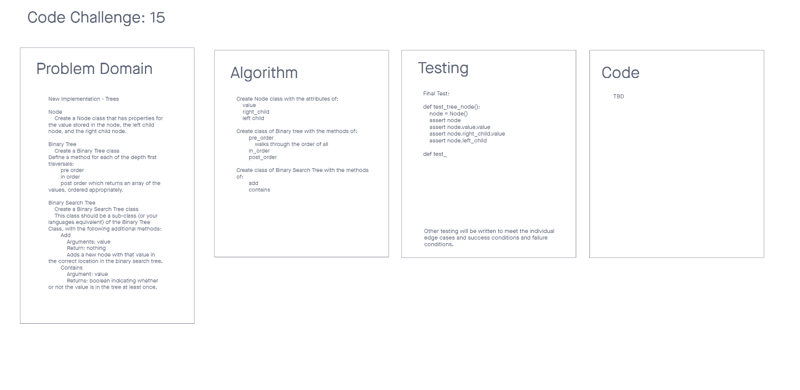

# Challenge Summary 15
Binary Tree and BST Implementation

## Specifications
- Read all of these instructions carefully.
- Name things exactly as described.
- Do all your work in a your data-structures-and-algorithms public repository.
- Create a new branch in your repo named as noted below.
- Follow the language-specific instructions for the challenge type listed below.
- Update the “Table of Contents” - in the README at the root of the repository - with a link to this challenge’s README file.

## Feature Tasks
#### Node
- Create a Node class that has properties for the value stored in the node, the left child node, and the right child node.

#### Binary Tree
- Create a Binary Tree class
- Define a method for each of the depth first traversals:
    - pre order
    - in order
    - post order which returns an array of the values, ordered appropriately.
- Any exceptions or errors that come from your code should be semantic, capture-able errors. For example, rather than a default error thrown by your language, your code should raise/throw a custom, semantic error that describes what went wrong in calling the methods you wrote for this lab.

#### Binary Search Tree
- Create a Binary Search Tree class
- This class should be a sub-class (or your languages equivalent) of the Binary Tree Class, with the following additional methods:
    - Add
        - Arguments: value
        - Return: nothing
        - Adds a new node with that value in the correct location in the binary search tree.
    - Contains
        - Argument: value
        - Returns: boolean indicating whether or not the value is in the tree at least once.

## Whiteboard Process
<!-- Embedded whiteboard image -->


## Approach & Efficiency
<!-- What approach did you take? Why? What is the Big O space/time for this approach? -->
The approach I took was to write the code first with an idea of getting to the end point.


## Solution
<!-- Show how to run your code, and examples of it in action -->
```
TBD
```
