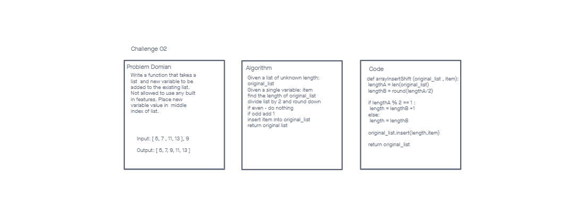

# Insert to Middle of an Array

### Problem Domain

Write a function that takes a list  and new variable to be added to the existing list. Not allowed to use any built in features. Place new variable value in  middle index of list.

## Whiteboard Process

## Approach & Efficiency
Using the invisionapp.com as the whiteboard tool.

