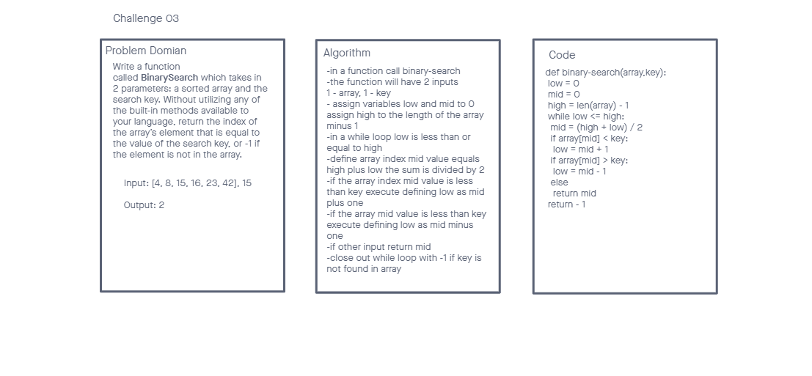

# Insert to Middle of an Array

### Problem Domain

Write a function called BinarySearch which takes in 2 parameters: a sorted array and the search key. Without utilizing any of the built-in methods available to your language, return the index of the array’s element that is equal to the value of the search key, or -1 if the element is not in the array.

## Whiteboard Process

## Approach & Efficiency
Using the invisionapp.com as the whiteboard tool.
- I have to admit, not too sure how to write a binary search used this ([article](https://www.geeksforgeeks.org/python-program-for-binary-search/)) for reference and attempted to write on my own

