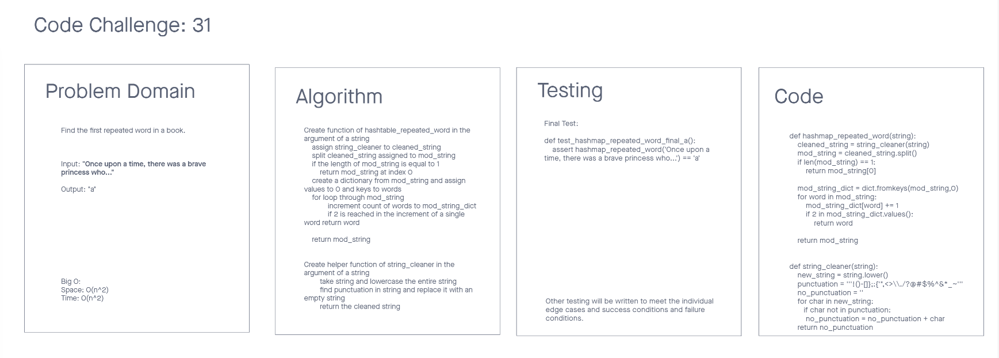

# Challenge Summary 17
Hashmap Repeated Word

## Specifications
- Read all of these instructions carefully.
- Name things exactly as described.
- Do all your work in a your data-structures-and-algorithms public repository.
- Create a new branch in your repo named as noted below.
- Follow the language-specific instructions for the challenge type listed below.
- Update the “Table of Contents” - in the README at the root of the repository - with a link to this challenge’s README file.

## Features
Write a function called repeated word that finds the first word to occur more than once in a string
Arguments: string
Return: string

## Structure and Testing
Utilize the Single-responsibility principle: any methods you write should be clean, reusable, abstract component parts to the whole challenge. You will be given feedback and marked down if you attempt to define a large, complex algorithm in one function definition.

Write at least three test assertions for each method that you define.

Ensure your tests are passing before you submit your solution.

## Whiteboard Process
<!-- Embedded whiteboard image -->


## Approach & Efficiency
<!-- What approach did you take? Why? What is the Big O space/time for this approach? -->
The approach I took was to write the code first with an idea of getting to the end point.

## Solution
<!-- Show how to run your code, and examples of it in action -->
```
TBD
```
