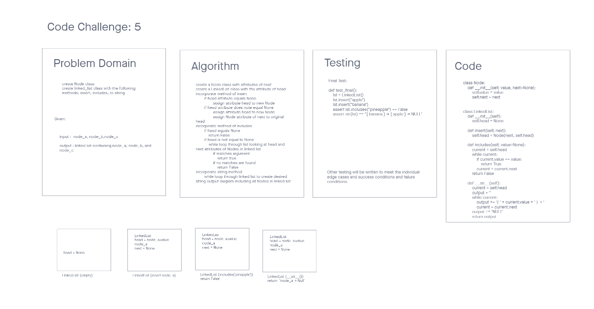

# Challenge Summary 10
Stack and Queue

## Specifications
- Read all of these instructions carefully.
- Name things exactly as described.
- Do all your work in a your data-structures-and-algorithms public repository.
- Create a new branch in your repo named as noted below.
- Follow the language-specific instructions for the challenge type listed below.
- Update the “Table of Contents” - in the README at the root of the repository - with a link to this challenge’s README file.

## Whiteboard Process
<!-- Embedded whiteboard image -->


## Approach & Efficiency
<!-- What approach did you take? Why? What is the Big O space/time for this approach? -->
The approach I took was to write the code first with an idea of getting to the end point.


## Solution
<!-- Show how to run your code, and examples of it in action -->
```
TBD
```
