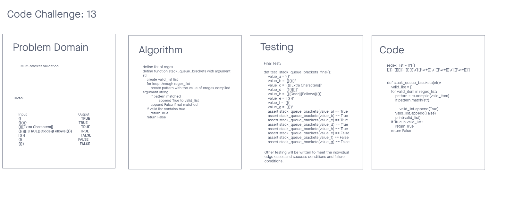

# Challenge Summary 13
Stack Queue Brackets

## Specifications
- Read all of these instructions carefully.
- Name things exactly as described.
- Do all your work in a your data-structures-and-algorithms public repository.
- Create a new branch in your repo named as noted below.
- Follow the language-specific instructions for the challenge type listed below.
- Update the “Table of Contents” - in the README at the root of the repository - with a link to this challenge’s README file.

## Feature Tasks
- Write a function called validate brackets
- Arguments: string
- Return: boolean
    - representing whether or not the brackets in the string are balanced

There are 3 types of brackets:
- Round Brackets : ()
- Square Brackets : []
- Curly Brackets : {}


## Whiteboard Process
<!-- Embedded whiteboard image -->


## Approach & Efficiency
<!-- What approach did you take? Why? What is the Big O space/time for this approach? -->
The approach I took was to write the code first with an idea of getting to the end point.


## Solution
<!-- Show how to run your code, and examples of it in action -->
```
regex_list = [r'[(][)]',r'[[][]]',r'[{][}]',r'[(]\w+[)]',r'[[]\w+[]]',r'[{]\w+[}]']


def stack_queue_brackets(str):
    valid_list = []
    for valid_item in regex_list:
        pattern = re.compile(valid_item)
        if pattern.match(str):

            valid_list.append(True)
        valid_list.append(False)
        print(valid_list)
    if True in valid_list:
        return True
    return False
```
