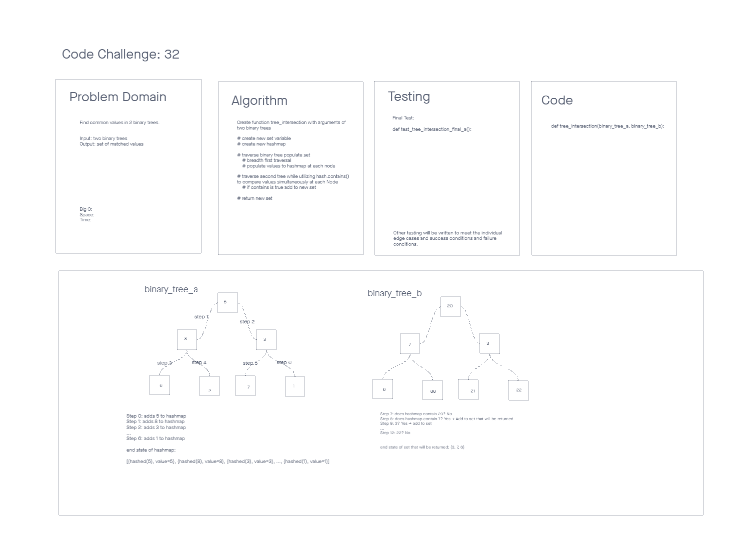

# Challenge Summary 32
Tree Intersection

## Collaboration

Pair programmed code, test, and pair developed white board with Chloe Nott.

## Specifications
- Read all of these instructions carefully.
- Name things exactly as described.
- Do all your work in a your data-structures-and-algorithms public repository.
- Create a new branch in your repo named as noted below.
- Follow the language-specific instructions for the challenge type listed below.
- Update the “Table of Contents” - in the README at the root of the repository - with a link to this challenge’s README file.

## Feature Tasks
Write a function called tree_intersection that takes two binary trees as parameters.
Using your Hashmap implementation as a part of your algorithm, return a set of values found in both trees.

## Structure and Testing
Utilize the Single-responsibility principle: any methods you write should be clean, reusable, abstract component parts to the whole challenge. You will be given feedback and marked down if you attempt to define a large, complex algorithm in one function definition.

Write at least three test assertions for each method that you define.

Ensure your tests are passing before you submit your solution.

## Whiteboard Process
<!-- Embedded whiteboard image -->


## Approach & Efficiency
<!-- What approach did you take? Why? What is the Big O space/time for this approach? -->
The approach I took was to write the code first with an idea of getting to the end point.

## Solution
<!-- Show how to run your code, and examples of it in action -->
```
import queue
from hash_table.hash_table import HashTable
from stack_and_queue.stack_and_queue import Queue

from all_trees.tree_node import Node
from all_trees.binary_tree import BinaryTree

# Create function tree_intersection with arguments of two binary trees
# create new set variable
# create new hashmap
# traverse binary tree populate set
	# breadth first traversal
	# populate values to hashmap at each node
# traverse second tree while utilizing hash.contains() to compare values simultaneously at each Node
	# if contains is true add to new set
# return new set

def tree_intersection(binary_tree_a, binary_tree_b ):
    new_set = set()
    hash_table = HashTable()

# traverse binary tree populate set
	# breadth first traversal
    queue_a = []
    queue_a.insert(0,binary_tree_a.root)
    while queue_a:
        item = queue_a.pop()
        # populate values to hashmap at each node
        hash_table.add(item.value)

        if item.left_child != None:
            queue_a.insert(0,item.left_child)

        if item.right_child != None:
            queue_a.insert(0,item.right_child)

# traverse second tree while utilizing hash.contains() to compare values simultaneously at each Node
    queue_b = []
    queue_b.insert(0,binary_tree_b.root)

    while queue_b:
        item = queue_b.pop()
    # populate values to hashmap at each node
        if hash_table.contains(item.value):
            print('queue_b containsL',item.value)
            new_set.add(item.value)

        if item.left_child != None:
            queue_b.insert(0,item.left_child)

        if item.right_child != None:
            queue_b.insert(0, item.right_child)

	# if contains is true add to new set

    return new_set
```
