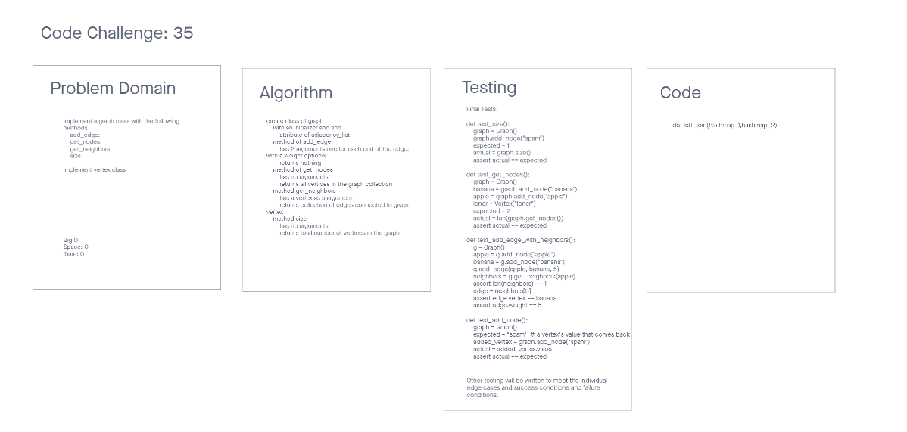

# Challenge Summary 30
Graphs

## Specifications
- Read all of these instructions carefully.
- Name things exactly as described.
- Do all your work in a your data-structures-and-algorithms public repository.
- Create a new branch in your repo named as noted below.
- Follow the language-specific instructions for the challenge type listed below.
- Update the “Table of Contents” - in the README at the root of the repository - with a link to this challenge’s README file.

## Features
Implement your own Graph. The graph should be represented as an adjacency list, and should include the following methods:

- add node
    - Arguments: value
    - Returns: The added node
    - Add a node to the graph
- add edge
    - Arguments: 2 nodes to be connected by the edge, weight (optional)
    - Returns: nothing
    - Adds a new edge between two nodes in the graph
    - If specified, assign a weight to the edge
    - Both nodes should already be in the Graph
- get nodes
    - Arguments: none
    - Returns all of the nodes in the graph as a collection (set, list, or similar)
- get neighbors
    - Arguments: node
    - Returns a collection of edges connected to the given node
    - Include the weight of the connection in the returned collection
- size
    - Arguments: none
    - Returns the total number of nodes in the graph

## Structure and Testing
Utilize the Single-responsibility principle: any methods you write should be clean, reusable, abstract component parts to the whole challenge. You will be given feedback and marked down if you attempt to define a large, complex algorithm in one function definition.

Write tests to prove the following functionality:

1. Node can be successfully added to the graph
1. An edge can be successfully added to the graph
1. A collection of all nodes can be properly retrieved from the graph
1. All appropriate neighbors can be retrieved from the graph
1. Neighbors are returned with the weight between nodes included
1. The proper size is returned, representing the number of nodes in the graph
1. A graph with only one node and edge can be properly returned
1. An empty graph properly returns null
1. Ensure your tests are passing before you submit your solution.

## Whiteboard Process
<!-- Embedded whiteboard image -->


## Approach & Efficiency
<!-- What approach did you take? Why? What is the Big O space/time for this approach? -->
The approach I took was to write the code first with an idea of getting to the end point.


## Solution
<!-- Show how to run your code, and examples of it in action -->
<!-- https://stephenagrice.medium.com/how-to-implement-a-hash-table-in-python-1eb6c55019fd -->
```
TBD
```

