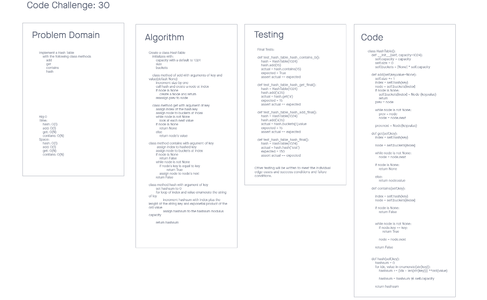

# Challenge Summary 30
Hash Tables

## Specifications
- Read all of these instructions carefully.
- Name things exactly as described.
- Do all your work in a your data-structures-and-algorithms public repository.
- Create a new branch in your repo named as noted below.
- Follow the language-specific instructions for the challenge type listed below.
- Update the “Table of Contents” - in the README at the root of the repository - with a link to this challenge’s README file.

## Features
Implement a Hashtable Class with the following methods:

- add
    - Arguments: key, value
    - Returns: nothing
    - This method should hash the key, and add the key and value pair to the table, handling collisions as needed.
- get
    - Arguments: key
    - Returns: Value associated with that key in the table
- contains
    - Arguments: key
    - Returns: Boolean, indicating if the key exists in the table already.
- hash
    - Arguments: key
    - Returns: Index in the collection for that key

## Structure and Testing
Utilize the Single-responsibility principle: any methods you write should be clean, reusable, abstract component parts to the whole challenge. You will be given feedback and marked down if you attempt to define a large, complex algorithm in one function definition.

Write tests to prove the following functionality:
1. Adding a key/value to your hashtable results in the value being in the data structure
1. Retrieving based on a key returns the value stored
1. Successfully returns null for a key that does not exist in the hashtable
1. Successfully handle a collision within the hashtable
1. Successfully retrieve a value from a bucket within the hashtable that has a collision
1. Successfully hash a key to an in-range value
1. Ensure your tests are passing before you submit your solution.

## Whiteboard Process
<!-- Embedded whiteboard image -->


## Approach & Efficiency
<!-- What approach did you take? Why? What is the Big O space/time for this approach? -->
The approach I took was to write the code first with an idea of getting to the end point.


## Solution
<!-- Show how to run your code, and examples of it in action -->
<!-- https://stephenagrice.medium.com/how-to-implement-a-hash-table-in-python-1eb6c55019fd -->
```
TBD
```

